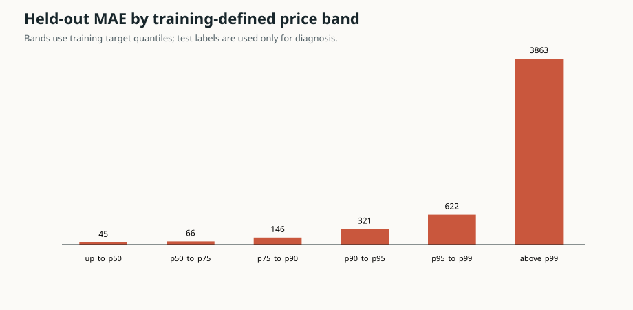
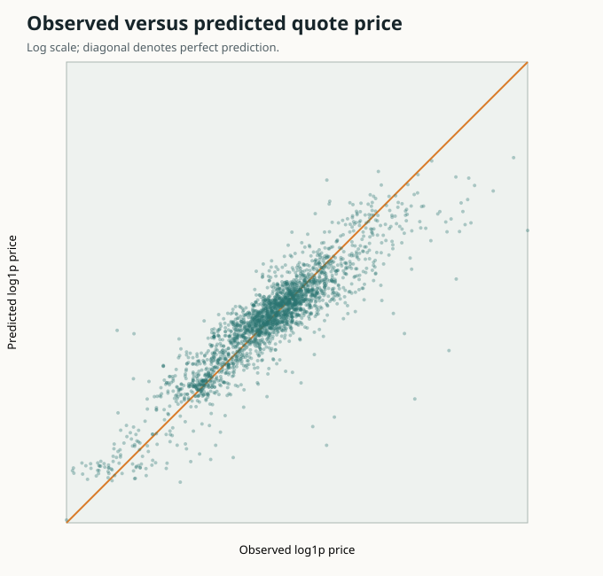

# Inside Airbnb Sydney quote-model card

Model artifact version: `2`. Snapshot: `2026-06-16`.

## Intended use

Estimate a public quoted nightly price in AUD for research and portfolio demonstration. It is not a realised booking price, optimal price, occupancy forecast, or revenue guarantee.

## Held-out performance

| Measure | Value |
| --- | ---: |
| Rows | 3,701 |
| MAE | AUD 138.14 |
| Median absolute error | AUD 50.37 |
| RMSE | AUD 514.52 |
| MAE improvement vs market median | 38.0% |
| 90% interval observed coverage | 89.5% |
| Median absolute percentage error | 19.4% |

## Diagnostic flags

| Dimension | Segment | Rows | Flag | Observed |
| --- | --- | ---: | --- | ---: |
| price_band | p75_to_p90 | 532 | absolute_median_bias_above_limit | -79.635 |
| price_band | p90_to_p95 | 172 | absolute_median_bias_above_limit | -257.228 |
| price_band | p95_to_p99 | 142 | absolute_median_bias_above_limit | -534.638 |
| price_band | p90_to_p95 | 172 | conditional_coverage_below_floor | 0.762 |
| price_band | p95_to_p99 | 142 | conditional_coverage_below_floor | 0.676 |
| price_band | p50_to_p75 | 970 | model_mae_worse_than_market_baseline | -0.022 |

## Upper-tail challenger status

- Decision: `NO_CHALLENGER_PASSED_ALL_GATES`.
- Selected challenger: `None`.
- The primary artifact was not replaced and the governed test set was not used.
- Premium/two-stage decision: `NO_CHALLENGER_PASSED_ALL_GATES`.
- Conditional-interval decision: `INTERVAL_CHALLENGER_REJECTED`.

## Evidence and limitations

- Test hosts do not overlap train or conformal-calibration hosts.
- Price bands are defined from training-target quantiles.
- Slice findings are disclosures, not test-set-driven model tuning rules.
- Conditional coverage is not guaranteed even when marginal coverage is near 90%.
- Coordinates are approximate and reference distances are straight-line distances.
- Availability and review-velocity proxies are excluded from the primary model.
- Deployment authority remains `research_only`.
- A compatible later Sydney snapshot is still required for temporal validation.

Machine-readable audit: `reports\inside_airbnb\sydney_2026-06-16_error_analysis.json`.
