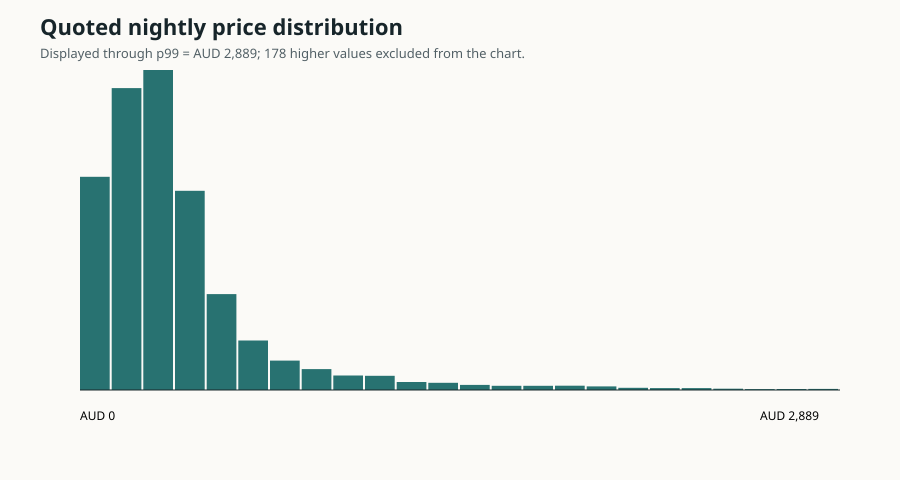
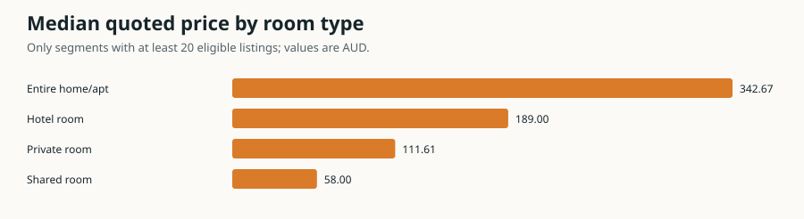
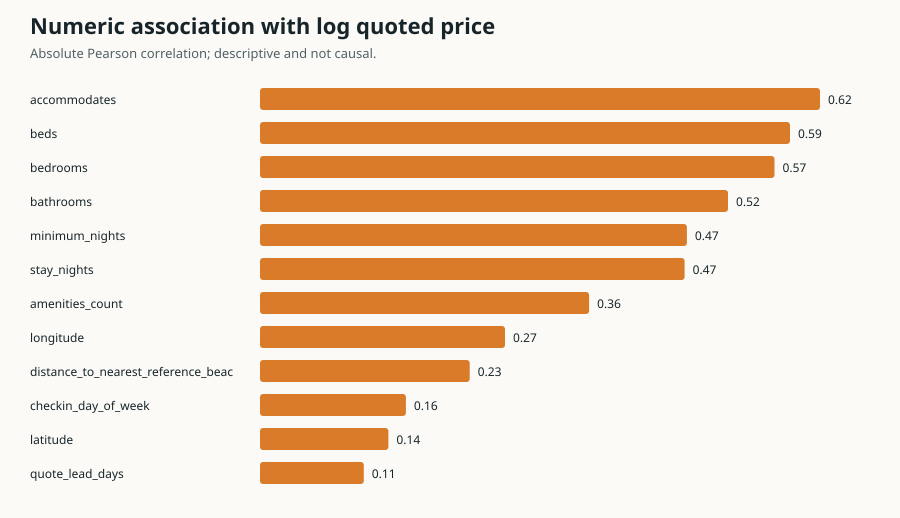
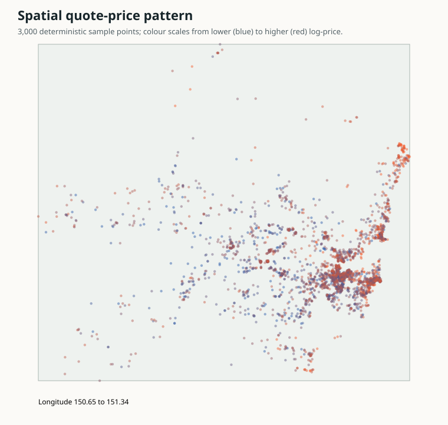

# Inside Airbnb Sydney modern EDA

Generated from the governed Silver table. Snapshot: `2026-06-16`.

## Executive findings

- 17,784 of 20,573 rows are training eligible.
- Median quoted nightly price is AUD 291; p95 is AUD 1,148 and p99 is AUD 2,889.
- There are 8,309 unique hosts; the largest host contributes 197 listings.
- The target is strongly right-skewed, so modelling and correlation diagnostics use `log1p(price)`.
- Availability and review-velocity columns remain labelled proxies and are excluded from the primary model.

## Charts

## Room-type segments

| Room type | Rows | Median AUD | IQR AUD |
| --- | ---: | ---: | ---: |
| Entire home/apt | 13,830 | 343 | 244–508 |
| Private room | 3,864 | 112 | 80–160 |
| Hotel room | 51 | 189 | 158–235 |
| Shared room | 39 | 58 | 52–74 |

## Strongest numeric associations

These are descriptive Pearson correlations with `log1p(price)`, not causal effects.

| Feature | Complete rows | Correlation |
| --- | ---: | ---: |
| `accommodates` | 17,784 | 0.620 |
| `beds` | 15,438 | 0.587 |
| `bedrooms` | 15,058 | 0.570 |
| `bathrooms` | 14,763 | 0.518 |
| `minimum_nights` | 17,778 | -0.473 |

## Method and boundaries

- Numeric summaries report explicit missingness and robust quantiles.
- Segment tables suppress groups with fewer than 20 rows.
- Spatial coordinates in Inside Airbnb are approximate; the map is a diagnostic, not parcel-level evidence.
- This report does not use the governed model test split and does not select a production model.

Machine-readable details: `reports\inside_airbnb\sydney_2026-06-16_modern_eda.json`.
